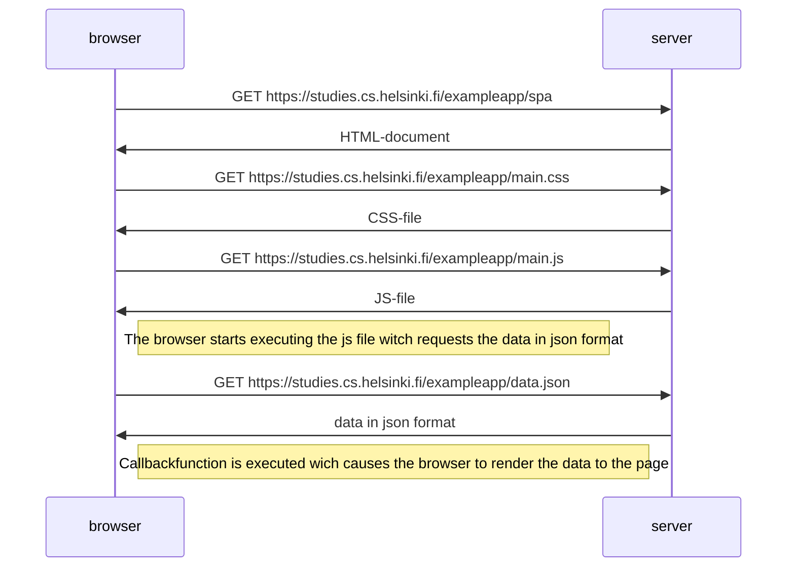

```mermaid
sequenceDiagram
    participant browser
    participant server

    browser->>server: GET https://studies.cs.helsinki.fi/exampleapp/spa              
    server->>browser: HTML-document
    browser->>server: GET https://studies.cs.helsinki.fi/exampleapp/main.css
    server->>browser: CSS-file
    browser->>server: GET https://studies.cs.helsinki.fi/exampleapp/main.js
    server->>browser: JS-file
    Note right of browser: The browser starts executing the js file witch requests the data in json format
    browser->>server: GET https://studies.cs.helsinki.fi/exampleapp/data.json
    server->>browser: data in json format
    Note right of browser: Callbackfunction is executed wich causes the browser to render the data to the page  
```
